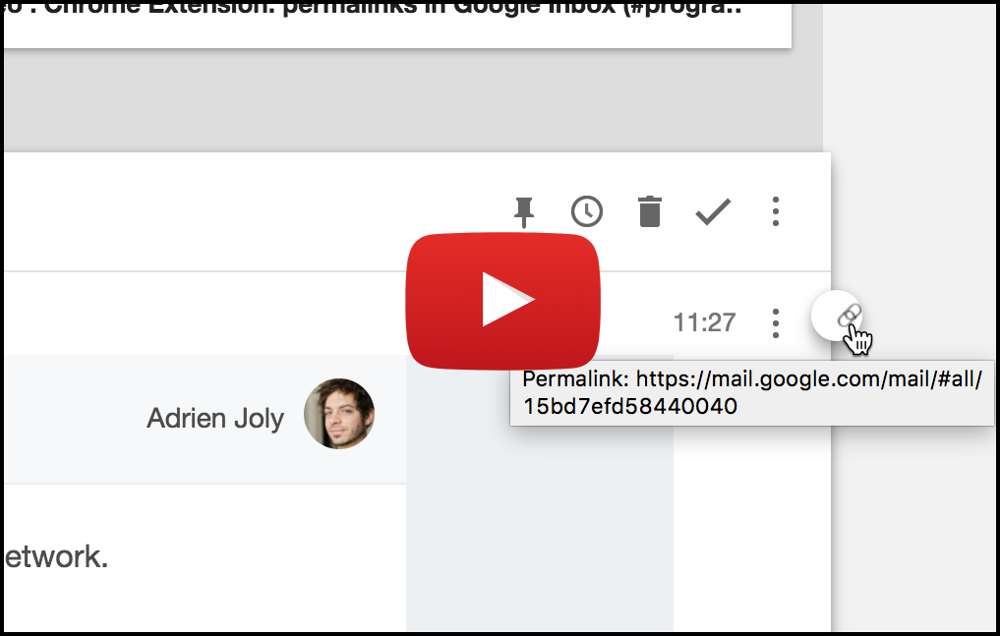

# Permalinks for Google Inbox (Chrome extension)

A minimal Chrome Extension that provides direct URLs to your emails, from Google Inbox.

▶️ **Install it** from Chrome Web Store: [Permalinks for Google Inbox](https://chrome.google.com/webstore/detail/eijfpfnadnijllpfdkdikfamdijafala)

⭐️ **Enjoying this extension?** [Tell others about it](https://www.producthunt.com/posts/permalinks-for-google-inbox), on ProductHunt!

## Demo

## Watch how I made that extension

I made this extension in one hour, live on Twitch, LiveEdu and Youtube.

You can watch the videos on Youtube:

- [part 1](https://www.youtube.com/watch?v=SUQQwr7etzo)
- [part 2](https://www.youtube.com/watch?v=lHzsZ3lpy5w)

## Contribute

Pull requests are welcome and appreciated.

Especially:

- to fix bugs;
- to improve the UI.
